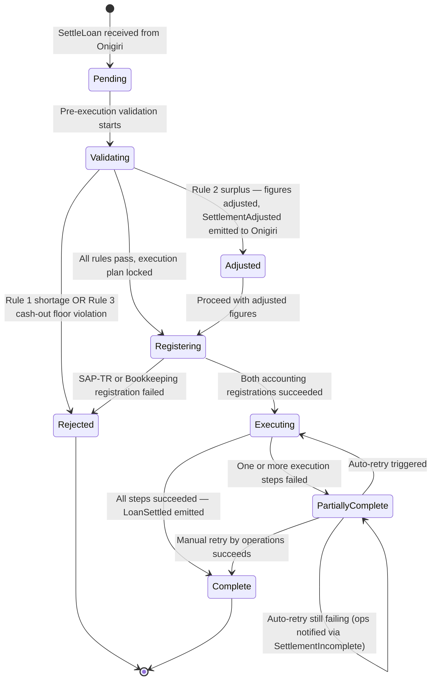

# Capability: Loan Settlement Engine

**Product**: Core Banking — [PRODUCT](../../PRODUCT.md)
**Portfolio**: Platform
**Product Owner**: TBD (Platform PO / Core Banking PO)
**Status**: 📝 Draft — @FEATURE decomposition pending
**Last Updated**: 2026-03-17

---

## Business Function

Orchestrate the end-to-end financial settlement of a loan agreement after it has been signed between borrower and lender. A settlement is a double-entry financial transaction: the sum of all Fund Disburse (sources, `+`) must equal the sum of all Fund Usage (applications, `-`). Loan Settlement Engine validates this balance, finalises the execution plan, coordinates all sub-systems, and maintains an auditable settlement trail.

Settlement is triggered by Onigiri once a loan agreement is confirmed. All monetary amounts are pre-calculated by Onigiri; the Settlement Engine validates actuals against those amounts and resolves any discrepancy before execution.

## Why It Exists (First Principles)

- **Settlement integrity**: A loan agreement commits both parties to specific financial flows. Without a dedicated orchestrator, no single system enforces that every disbursed baht is accounted for across cash-out, payoffs, insurance, and fees — creating reconciliation risk.
- **Multi-destination disbursement**: Loan proceeds flow to multiple external and internal destinations (borrower account, old loan, insurance broker, GL). A single capability owning this routing eliminates race conditions and partial-commit ambiguity.
- **Standalone sub-operations**: Loan Account Management must remain independently callable (create, top-up, close). Settlement Engine uses these operations but does not own them — it orchestrates them within a settlement context.
- **Regulatory auditability**: Every settlement must produce an immutable record of what was agreed, what was adjusted, and what was executed — step by step.
- **Dual accounting system transition**: NTB is migrating from SAP-TR to a Bookkeeping system. Settlement Engine must write to both in parallel during the transition period to enable reconciliation validation before SAP-TR is decommissioned.

---

## Feature Inventory

| Feature | Status | Description |
|---------|--------|-------------|
| Settlement Instruction Intake | Draft | Receive `SettleLoan` command from Onigiri. Parse Fund Disburse and Fund Usage line items. Assign a unique Settlement ID. |
| Pre-Execution Validation | Draft | Fetch current outstanding of any referenced loan accounts. Apply Rule 1 (shortage), Rule 2 (surplus), Rule 3 (cash-out floor). Reject or proceed with adjustment. |
| Settlement Computation | Draft | Finalise execution plan: resolve adjusted amounts (Rule 2), map each line item to its execution handler, lock the plan before execution begins. |
| Fund Disburse Orchestration | Draft | Invoke Loan Account Management: create new loan account (new financing) or top-up existing account (top-up financing) with multi-component outstanding (principal, accrued fee prior, court/legal fee). |
| Fund Usage — Cash-out (A) | Draft | Instruct Hora to transfer net cash proceeds to the borrower's nominated bank account (NTB entity). |
| Fund Usage — Loan Payoff (B) | Draft | Invoke Loan Account Management to apply payment and close the specified existing loan account. Used in restructure and Type 1 top-up. |
| Fund Usage — Insurance Purchase (C) | Draft | Forward insurance key and premium amount to OnePiece for purchase via NTBI entity. |
| Fund Usage — Fee Deduction (D) | Draft | Execute fee deductions within the settlement (VAT, stamp duty, origination fees, legal fees). Each fee type is a separate line item. Fee entries are recorded asynchronously to both accounting systems via Accounting Recording. Future: E-tax / E-stamp integration. |
| Accounting Registration | Draft | Pre-execution synchronous step. For SAP-TR: check if person profile exists (customer ID card) → register if absent; then register loan account under person profile (contract number, loan type). For Bookkeeping: register loan account. Both registrations must succeed before execution begins. Skip if already registered. |
| Settlement Step Accounting Recording | Draft | After each execution step completes, asynchronously record the cashflow entry to both SAP-TR and Bookkeeping (direct call). Covers every step: Fund Disburse (new loan / top-up), Fund Usage A (cash-out), B (loan payoff), C (insurance premium), D (each fee type). Recording failures retry independently and do not block settlement completion. |
| Dual-Write Transition Management | Draft | During the parallel transition period, every accounting entry is written to both SAP-TR and Bookkeeping simultaneously. Reconciliation job compares outputs between the two systems and flags discrepancies. After 6-month parallel validation, SAP-TR is decommissioned and Bookkeeping becomes the sole accounting system. |
| Settlement State Management | Draft | Track settlement lifecycle (Pending → Validating → Registering → Executing → Complete / PartiallyComplete / Rejected). Persist step-level completion status. Accounting recording state tracked separately from execution state. |
| Partial Commit & Retry | Draft | On execution step failure: mark settlement as PartiallyComplete, record failed steps, trigger auto-retry. Escalate to operations (Sensei) if auto-retry exhausted. On accounting recording failure: retry independently in background; does not affect settlement execution state. |
| Settlement Audit Trail | Draft | Immutable append-only record of every settlement event: instruction received, validation outcome, adjustments, accounting registration result, each execution step result, each accounting recording result, final status. |

---

## Business Rules

### Pre-Execution Validation Rules

| Rule | Condition | Resolution |
|------|-----------|------------|
| **Rule 1 — Shortage** | Σ Fund Disburse < Σ Fund Usage (after fetching actual outstanding on referenced loans) | **Reject**. Return `SettlementValidationFailed` to Onigiri with: shortage amount, affected line item(s), reason (e.g. "old loan outstanding increased by ฿X from post-signing transaction on YYYY-MM-DD"). No posting occurs. |
| **Rule 2 — Surplus** | Σ Fund Disburse > Σ Fund Usage (e.g. borrower made payment to old loan before settlement, reducing payoff amount) | **Proceed with adjustment**. Recalculate affected Fund Usage line items. Record delta. Emit `SettlementAdjusted` to Onigiri with adjustment details before executing. |
| **Rule 3 — Cash-out floor** | Principal disbursement < Cash-out disbursement (Fund Usage A) | **Reject**. Lender cannot disburse more cash to borrower than principal outstanding posted to the loan account. |

### Fund Disburse Types (mutually exclusive per settlement)

| Type | Trigger | Action |
|------|---------|--------|
| **New Loan** | Onigiri instruction specifies new account creation | Call Loan Account Management: create new loan account + post outstanding components |
| **Top-Up (Existing)** | Onigiri instruction specifies existing account ID | Call Loan Account Management: post additional outstanding components to existing account + update loan terms |

> One settlement operates on one Fund Disburse type only. A single settlement cannot create a new account and top-up an existing account simultaneously.

### Fund Usage Categories (combinable within one settlement)

| Code | Name | Destination | Entity | Notes |
|------|------|-------------|--------|-------|
| **A** | Cash-out disburse | Hora → borrower bank account | NTB | Net lending proceeds to borrower. Subject to Rule 3. |
| **B** | Loan payoff | Loan Account Management → existing loan closure | NTB | Used in restructure (close old loan) and Type 1 top-up. Payoff amount validated against actual outstanding (Rule 1/2). |
| **C** | Insurance purchase | OnePiece → NTBI entity | NTB → NTBI | Settlement forwards insurance key + premium. NTBI broker executes policy purchase. |
| **D** | Fee deduction | Account System (NTB GL) | NTB | VAT, stamp duty, origination fee, legal fee. Internal bookkeeping posting. Future: E-tax / E-stamp integration. |

### Accounting System Integration Rules

#### Registration (synchronous — pre-execution gate)

| System | Registration Sequence | Skip Condition |
|--------|----------------------|----------------|
| **SAP-TR** | 1. Check person profile (customer ID card) → register if absent 2. Register loan account under person (contract number, loan type) | Step 1 skipped if person already registered. Step 2 skipped if account already registered. |
| **Bookkeeping** | 1. Register loan account | Skip if account already registered. |

> Registration must succeed for both systems before the execution plan begins. Registration failure is treated as a blocking pre-condition failure — settlement moves to Rejected state with reason.

#### Recording (asynchronous — post each execution step)

| Settlement Step | Cashflow Entry Recorded |
|----------------|------------------------|
| Fund Disburse — New Loan | Principal outstanding posted to new loan account |
| Fund Disburse — Top-Up | Additional outstanding components posted to existing account |
| Fund Usage A — Cash-out | Net cash transfer to borrower |
| Fund Usage B — Loan Payoff | Payment applied to close existing loan |
| Fund Usage C — Insurance | Insurance premium forwarded to NTBI |
| Fund Usage D — Fee Deduction | One entry per fee type (VAT, stamp duty, origination fee, legal fee) |

Recording is fire-and-forget from the settlement execution perspective. Failures are retried independently. Settlement can reach Complete state with accounting recording still pending/retrying.

#### Dual-Write Transition Policy

| Period | SAP-TR | Bookkeeping | Reconciliation |
|--------|--------|-------------|----------------|
| **Transition (parallel run, 6 months)** | Active — receives all entries | Active — receives all entries | Reconciliation job compares both; discrepancies flagged to Finance team |
| **Post-transition** | Decommissioned | Active — sole system | N/A |

### Settlement Balance Rule

```
Σ (Fund Disburse line items) = Σ (Fund Usage line items)
```

After Rule 2 adjustment, the adjusted figures must balance before execution begins. The locked execution plan is immutable once execution starts.

### Partial Commit & Retry Policy

| Step Outcome | Immediate Action | Retry Behaviour | Escalation |
|---|---|---|---|
| Step succeeds | Mark step complete, proceed to next | N/A | N/A |
| Step fails | Mark step failed, record error | Auto-retry up to configured max attempts with backoff | If retry exhausted: emit `SettlementIncomplete` to Sensei/Operations; operations team manually reviews and triggers retry |
| All steps complete | Mark settlement Complete, emit `LoanSettled` | N/A | N/A |

> Partial commits are permitted. A settlement that is PartiallyComplete is a valid recoverable state. The settlement ID tracks all step states for resumption.

---

## Settlement State Machine



> **Note — Accounting Recording state**: Recording runs asynchronously after each execution step. Recording success/failure is tracked in the Settlement Audit Trail but does not affect the settlement state machine. A settlement in `Complete` state may still have accounting recording retries in progress.

---

## Settlement Examples

### Example 1 — Simple New Loan with Cash-out

```
Agreed loan: ฿100,000 principal
Fund Disburse:  New loan account — principal outstanding ฿100,000
Fund Usage:     A: Cash-out ฿100,000 → borrower
Balance check:  ฿100,000 = ฿100,000  ✓
```

### Example 2 — Restructure (close old loan + cash-out difference)

```
Old loan outstanding: ฿100,000
New loan agreed:      ฿120,000
Fund Disburse:  New loan account — principal outstanding ฿120,000
Fund Usage:     B: Loan payoff old loan ฿100,000
                A: Cash-out ฿20,000 → borrower
Balance check:  ฿120,000 = ฿120,000  ✓
```

### Example 3 — Rule 2 Surplus (borrower paid down before settlement)

```
Agreed:             Old loan payoff = ฿100,000
Actual at settlement: Old loan outstanding = ฿95,000 (borrower paid ฿5,000 early)
Rule 2 triggered:   Surplus ฿5,000
Adjustment:         Fund Usage B adjusted to ฿95,000; surplus ฿5,000 redirected to Fund Usage A (cash-out)
SettlementAdjusted: sent to Onigiri with delta details
Execution proceeds: New loan disbursed ฿100,000; old loan closed at ฿95,000; borrower receives ฿5,000 additional cash
Balance check:  ฿100,000 = ฿95,000 + ฿5,000  ✓
```

### Example 4 — New Loan with Insurance and Fees

```
Agreed loan: ฿130,000
Fund Disburse:  New loan account — principal outstanding ฿130,000
Fund Usage:     A: Cash-out ฿100,000 → borrower (via Hora)
                C: Insurance premium ฿20,000 → OnePiece / NTBI (key: ABC)
                D: Stamp duty ฿5,000 (fee deduction)
                D: VAT ฿5,000 (fee deduction)
Balance check:  ฿130,000 = ฿130,000  ✓
Rule 3 check:   Principal ฿130,000 ≥ Cash-out ฿100,000  ✓

Accounting:
  Pre-execution: Register person + loan account in SAP-TR; register loan account in Bookkeeping
  Post each step: Record cashflow asynchronously to SAP-TR + Bookkeeping
  Entries: 1× Fund Disburse, 1× Cash-out, 1× Insurance, 2× Fee (stamp duty, VAT)
```

---

## Integration Map

| Direction | System | Call / Event | Trigger | Mode |
|-----------|--------|--------------|---------|------|
| ← Receives | Onigiri | `SettleLoan` | Loan agreement confirmed | Sync |
| → Calls | Loan Account Management (internal) | Create / Top-Up / Close loan account | Fund Disburse + Usage B | Sync |
| → Calls | Hora | `CashOutTransferInstruction` | Fund Usage A | Sync |
| → Calls | OnePiece | `InsurancePurchaseInstruction` | Fund Usage C | Sync |
| → Calls | **SAP-TR** | `RegisterPersonProfile` | Accounting Registration (if person absent) | Sync (pre-execution) |
| → Calls | **SAP-TR** | `RegisterLoanAccount` | Accounting Registration | Sync (pre-execution) |
| → Calls | **SAP-TR** | `RecordCashflow` | Per execution step | **Async** (post-step) |
| → Calls | **Bookkeeping** | `RegisterLoanAccount` | Accounting Registration | Sync (pre-execution) |
| → Calls | **Bookkeeping** | `RecordAccountingTransaction` | Per execution step | **Async** (post-step) |
| → Emits | Onigiri | `SettlementValidationFailed` | Rule 1 / Rule 3 rejection | Sync response |
| → Emits | Onigiri | `SettlementAdjusted` | Rule 2 surplus | Event |
| → Emits | Onigiri / DaVinci | `LoanSettled` | Settlement Complete | Event |
| → Emits | Sensei / Operations | `SettlementIncomplete` | Execution auto-retry exhausted | Event |

---

## NFRs

| NFR | Requirement |
|-----|-------------|
| Settlement atomicity (at step level) | Each step is independently atomic. The settlement as a whole is eventually consistent via retry. No step may be executed twice (idempotency key per step). |
| Audit trail completeness | Every state transition and step result must be persisted to the immutable settlement audit trail before the next step executes. |
| Validation determinism | Given the same instruction and the same account state at validation time, Rule 1 / 2 / 3 must always produce the same outcome. |
| Settlement ID uniqueness | Each `SettleLoan` command produces exactly one Settlement ID. Duplicate submissions with the same agreement reference are rejected. |
| Retry idempotency | Auto-retry and manual retry of a failed execution step must not double-post. Each step execution is guarded by an idempotency key. |
| Accounting recording independence | Accounting recording failures must not propagate to the settlement execution state. A `Complete` settlement with pending recording retries is a valid state. |
| Dual-write consistency | During the parallel transition period, every cashflow entry written to SAP-TR must have an equivalent entry in Bookkeeping with the same amount, step reference, and settlement ID. Discrepancies must be detectable by the reconciliation job. |
| Registration idempotency | Re-running accounting registration for an already-registered person or account must not create duplicates. Systems must support check-before-register or upsert semantics. |

---

## Open Questions

- What is the maximum number of auto-retry attempts before escalation to operations for execution step failures? (Suggest: 3 attempts with exponential backoff — to be confirmed with engineering)
- What is the retry policy for accounting recording failures specifically — same limit as execution retries, or separate (e.g. more attempts given async nature)?
- Is `SettlementAdjusted` a blocking notification (Onigiri must acknowledge before execution proceeds) or non-blocking (execution proceeds, Onigiri informed asynchronously)?
- For Rule 2 surplus redistribution — is the default always to redirect surplus to cash-out (Fund Usage A), or can Onigiri specify a different destination in the instruction?
- What is the planned SAP-TR decommission timeline? The 6-month parallel run start date determines when Dual-Write Transition Management can be scoped off.
- What fee type taxonomy and cashflow entry schema does SAP-TR expect for `RecordCashflow`? (To be defined with Finance team — required before Feature spec for Fund Usage D and Accounting Recording)
- Does the reconciliation job between SAP-TR and Bookkeeping live in Core Banking, or is it owned by Finance / a separate reconciliation system?
